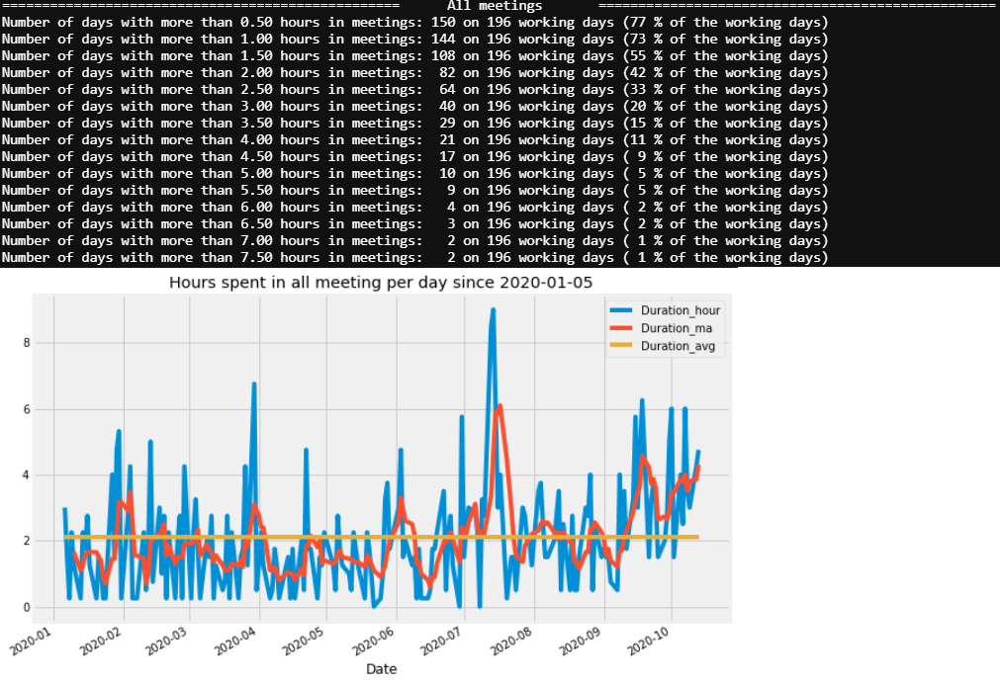

 

# Basic outlook calendar exploration

**Rem:** Depending on your OS settings, you might have to change the date format (which is an input of some functions). You can also modify the dictionary for matching the categories.

## How to export Outlook calendar data

 

## How to run the script

You can either run the script using the python console, an IDE or use the corresponding Notebook

## Output

It is currently very basic and will compute fairly the time spent in meetings, taking into account the overlaps, out-of-office, blank and canceled events.
 - Time spent in meetings overall, with the fraction of typical working day duration
 - Time spent in agile related meetings (or whatever you want to report instead)
 - The meetings are flagged using a list of keywords that you can modify (the better you encode the subjects in outlook, the better it'll work).
 - The corresponding charts: daily, weekly and monthly

E.G.

 
